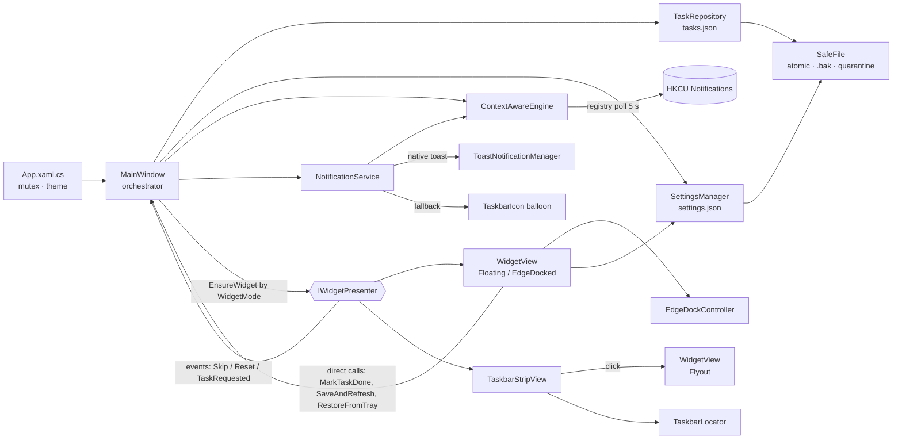

# Task And Ticket Tracker — Knowledge Base

> Single source of truth for **what the app is, how it is built, how it ships, and where it deviates from its requirements**.
> Compiled from a full review of the requirement documents, user docs, source code, packaging configuration and git history.
>
> **Snapshot:** version `1.4.3.7` (development build) · based on `main` @ `66e57fa` + uncommitted changes · updated 2026-09-25

---

## Contents

1. [Product Overview](#1-product-overview)
2. [Documentation Map](#2-documentation-map)
3. [Requirements vs. Implementation](#3-requirements-vs-implementation)
4. [Solution & Architecture](#4-solution--architecture)
5. [Data Model & Persistence](#5-data-model--persistence)
6. [Business Rules](#6-business-rules)
7. [User Interface Surfaces](#7-user-interface-surfaces)
8. [Context Awareness & Notifications](#8-context-awareness--notifications)
9. [Theming](#9-theming)
10. [Build, Run & Test](#10-build-run--test)
11. [Packaging, Versioning & Release](#11-packaging-versioning--release)
12. [Version History](#12-version-history)
13. [Known Issues & Technical Debt](#13-known-issues--technical-debt)
14. [Roadmap](#14-roadmap)
15. [Glossary](#15-glossary)

---

## 1. Product Overview

**Task And Ticket Tracker** is a lightweight Windows desktop productivity tool that keeps the user focused on a small number of *active* tasks while the rest of the backlog stays out of sight.

| Aspect | Summary |
|---|---|
| Core idea | Focus on the currently active ticket(s); everything else is backlog. |
| Primary surfaces | Manager window (backlog, details, settings) · **widget** in one of three styles (floating, edge-docked, taskbar strip) · system-tray icon |
| Privacy stance | 100 % local and offline. No telemetry and no network connections. See `PRIVACY.md`. |
| Context awareness | While Windows notifications are off (Do Not Disturb), reminder text is replaced by a generic message so task details are never shown on a shared screen. |
| Platform | Windows 10 (19041+) / Windows 11, x64 |
| Stack | .NET 10, WPF, C#, `H.NotifyIcon.Wpf` 2.4.1, WinRT toast APIs |
| Distribution | Microsoft Store (MSIX), plus a legacy Inno Setup installer |
| Store identity | `TanmayPrasad.TaskAndTicketTracker` · publisher `CN=00F61C64-FF38-455E-8D55-F7094707F364` |

---

## 2. Documentation Map

| File | Purpose | Status |
|---|---|---|
| `README.md` | Entry point: what the app is and links to the other docs. | Current. |
| `INSTRUCTIONS.md` | End-user guide: install, tasks, active rules, widget, tray, reminders, data. | Current. |
| `KNOWLEDGE_BASE.md` | This document: architecture, rules, release process, known issues. | Current. |
| `CHANGELOG.md` | Release history. | Current. |
| `PACKAGING_CONFIG.md` | Store identity, past Partner Center rejections, **versioning rules** (including dev builds). | Current — authoritative for releases. |
| `PRIVACY.md` | Privacy policy for the Store listing; linked from the About page. | Current. |
| `DocumentationWindow.xaml` | In-app user guide (About → Open user guide, or F1): card sections, shortcut table. | Current. |
| `v1_documentation.md` | Feature highlights and screenshots from `TaskTra/`. | Current. *(untracked, as are the screenshots)* |
| `Task Tracker App Development.md` | Original requirements and architectural blueprint. | **Aspirational** — much of it is not implemented, and Teams detection was deliberately removed (see §3). |
| `Architectural Blueprint and Migration Strategy … .md` | Future plan: port to **Avalonia UI** with component MVVM and a pluggable AI-chat view. | **Future** — not started. *(untracked)* |

---

## 3. Requirements vs. Implementation

Requirements taken from `Task Tracker App Development.md` and `CHANGELOG.md`.

| # | Requirement | Status | Where / Notes |
|---|---|---|---|
| R1 | Focus on a single active task; demote others to background | ✅ Done (configurable) | `EnforceActiveTaskRules` in `MainWindow.xaml.cs`. Limit = `MaxActiveTasks` (default **2**). |
| R2 | Minimize to system tray, not taskbar | ✅ Done | `Window_StateChanged` hides the window; tray via `H.NotifyIcon`. |
| R3 | Borderless, draggable, always-on-top widget | ✅ Done | `WidgetView.xaml` (`WindowStyle=None`, `Topmost`); drag via Win32 `WM_NCLBUTTONDOWN` in `Border_MouseLeftButtonDown`. Non-activating since 1.4.3.2. |
| R4 | Widget must not be lost off-screen | ✅ Done (1.4.3.2) | The saved position is clamped to a work area on load and when the display changes; tray → **Reset Widget Position** remains as manual recovery. |
| R5 | Fluent look; follow OS light/dark live (`UISettings.ColorValuesChanged`) | ⚠️ Partial | Custom Dark/Light dictionaries; "System" reads the registry **once** at startup. |
| R6 | Detect DND via `FocusSessionManager` (Win11) | ❌ Not done | Only the registry check is used (K4). |
| R7 | Detect DND via registry fallback | ✅ Done | `ContextAwareEngine`, 5 s `DispatcherTimer`. |
| R8 | Detect Teams calls (WebSocket / UI Automation / mic-cam) | 🚫 **Removed in 1.4.3.1** | The WebSocket stub never worked because it had no pairing token. It was dropped to keep the app fully offline. |
| R9 | Obfuscated notification payload during distraction | ✅ Done | `NotificationService.ShowTaskReminder`. |
| R10 | Silent Action-Center routing (`ToastNotifierCompat.Hide`) | ❌ Not done | — |
| R11 | Fallback when native toasts are unavailable | ✅ Done (differently) | `H.NotifyIcon` tray balloon instead of a custom WPF toast. |
| R12 | Jira / Azure DevOps integration via `ITicketProvider` | ❌ Not done | The "ticket number" (`VstsNumber`) is free text. No REST calls. |
| R13 | Low memory footprint in background | ✅ Done | `TrimMemory()` → `SetProcessWorkingSetSize` after load. |
| R14 | Sub-task steps with drag-and-drop reorder (v1.4.1.0) | ✅ Done | `TicketStep`; details panel and widget step carousel. |
| R15 | Deadline reminders | ✅ Done (not in original spec) | `NotificationService.PollingTimer_Tick`. |
| R16 | Single-instance app | ✅ Done | Named mutex `TaskTrackerAppMutex_OneApp` in `App.xaml.cs` (also used as the Inno Setup `AppMutex`). |
| R17 | User data must never be silently lost | ✅ Done (1.4.3.1) | Atomic writes, `.bak` rollback, corrupt-file quarantine and recovery (§5.3). |
| R18 | Widget must not get in the way of OS/app interaction; style selectable in Settings | ✅ Done (1.4.3.2) | Three styles (§7.2): Floating, Edge-docked peek, Taskbar strip. No focus stealing in all styles. |

---

## 4. Solution & Architecture

### 4.1 Repository layout

```
Tasks_v1/
├─ TaskTracker.slnx                     Solution (3 projects)
├─ TaskTrackerApp/                      WPF application (the product)
│  ├─ App.xaml(.cs)                     Startup, single-instance mutex, theme switching, global scrollbar style
│  ├─ MainWindow.xaml(.cs)              Manager window + tray icon + ALL orchestration logic (~1.1k LOC code-behind)
│  ├─ WidgetView.xaml(.cs)              Full widget (roles: Floating, EdgeDocked, Flyout)
│  ├─ TaskbarStripView.xaml(.cs)        Taskbar strip widget style (experimental)
│  ├─ DocumentationWindow.xaml(.cs)     In-app help dialog
│  ├─ ContextAwareEngine.cs             Do Not Disturb detection
│  ├─ NotificationService.cs            Deadline polling + context-aware toasts
│  ├─ Data/TaskRepository.cs            tasks.json load/save with recovery
│  ├─ Data/SettingsManager.cs           settings.json load/save
│  ├─ Data/SafeFile.cs                  Atomic write + .bak + quarantine helpers
│  ├─ Converters.cs                     TaskFormat (due text/urgency, step progress) + list/form converters
│  ├─ Themes/Controls.xaml              Fluent control styles + type ramp (shared by all windows)
│  ├─ Theming/                          AccentService + AccentMath, WindowEffects (Mica), Motion
│  ├─ TaskInput.cs                      Quick-add parsing, pasted-step splitting, next auto ticket, next-week date
│  ├─ Widgets/IWidgetPresenter.cs       Interface MainWindow uses for any widget style
│  ├─ Widgets/WidgetText.cs             "#ticket · step/name" formatting
│  ├─ Widgets/DockMath.cs               Pure edge-snap / collapse geometry (unit-tested)
│  ├─ Widgets/EdgeDockController.cs     Snap, slide-in/out animation, display-change handling
│  ├─ Widgets/TaskbarLocator.cs         Taskbar/tray geometry, auto-hide + fullscreen detection
│  ├─ Widgets/NativeMethods.cs          All Win32 interop (physical pixels)
│  ├─ Models/TaskModel.cs               TaskModel, TicketStep
│  ├─ Models/SettingsModel.cs           User settings
│  ├─ Themes/DarkTheme.xaml, LightTheme.xaml
│  └─ Properties/PublishProfiles/ClickOnceProfile.pubxml
├─ TaskTrackerApp.Packaging/            Windows Application Packaging Project (.wapproj) → MSIX
│  ├─ AppxManifest.xml                  Store identity + version (authoritative)
│  └─ Images/                           Tile/Store logos
├─ TaskTrackerApp.Tests/                NUnit tests (engine, repository recovery, widget text, dock geometry)
├─ .github/workflows/build-msix.yml     CI: tests, builds & self-signs the MSIX bundle on push to main
├─ .github/workflows/release-store.yml  Release: v*.*.*.0 tag → validate, test, package, approve, submit to the Store
├─ build-msix.ps1                       Local version-bump + package script (older; prefer scripts/Set-Version.ps1)
├─ scripts/                             Set-Version, Test-ReleaseVersion, Get-ReleaseNotes (release tooling)
├─ setup.iss                            Inno Setup installer script (legacy channel)
└─ StoreAssets/                         Store listing logos

Ignored / local only: TaskTrackerApp/Output/, MSIX/, Releases/, publish_inno/, TaskTra/ (screenshots)
```

### 4.2 Architectural style

The app is **code-behind driven, not MVVM**. `MainWindow` is the orchestrator: it owns the task list, the repository, the settings manager, the context engine, the notification service and the widget. Views are updated imperatively (`RefreshGrid`, `SetActiveTasks`), and there is no dependency-injection container. **All app logic runs on the UI thread**, including both timers (`DispatcherTimer`).



### 4.3 Key lifecycle flows

**Startup**
1. `App.OnStartup` acquires the mutex; if another instance exists, it shuts down.
2. The theme is applied from `settings.json`.
3. The `MainWindow` constructor creates the engines, starts `ContextAwareEngine.StartMonitoring()`, restores the details-panel maximize state and calls `LoadTasks()`. That call shows a warning dialog if the task file had to be recovered, migrates the legacy state `"Doing"` to `"In progress"`, enforces the active-task rules and pushes the tasks to `NotificationService`.
4. `Loaded` → `TrimMemory()`.

**Minimize → widget:** `Window_StateChanged(Minimized)` hides the manager and calls `EnsureWidget(settings)`. That returns the presenter for `WidgetMode`, recreating it if the style changed (and falling back to Floating when the taskbar strip is unsupported). The manager then applies the settings, passes the active tasks and shows it. Saving Settings with a new style swaps the presenter immediately.

**Restore:** tray double-click, **Show Manager**, or the widget's ⛶ button calls `RestoreFromTray()`. This shows the manager, hides the widget and **reloads the tasks from disk** (which re-runs the active-task rules).

**Save pipeline** (`SaveAndRefresh`)
1. Renumber priorities 1…N from list order.
2. `EnforceActiveTaskRules()`.
3. `PersistTasks()` (write `tasks.json`; on I/O failure, show an error and keep the data in memory).
4. Refresh the grid, push the tasks to `NotificationService`, and update the widget if it is visible.

Widget Skip and Reset call `PersistTasks()` directly, without running the rest of the pipeline (K10).

---

## 5. Data Model & Persistence

All data lives in **`%LOCALAPPDATA%\TaskTrackerApp\`** as indented JSON (`System.Text.Json`).

> Under MSIX, `%LOCALAPPDATA%` writes may be virtualized into `%LOCALAPPDATA%\Packages\TanmayPrasad.TaskAndTicketTracker_5njg6p2f7v32e\LocalCache\Local\TaskTrackerApp\`.

| File | Purpose |
|---|---|
| `tasks.json` | Current task list |
| `tasks.json.bak` | Previous version, refreshed on every save |
| `tasks.corrupt-<yyyyMMdd-HHmmss>.json` | Unreadable file moved aside during recovery. Never overwritten. |
| `settings.json` / `settings.json.bak` | Settings and their previous version |
| `settings.corrupt-<…>.json` | Unreadable settings moved aside (defaults are then used) |

### 5.1 `tasks.json` — `List<TaskModel>`

| Field | Type | Default | Notes |
|---|---|---|---|
| `Id` | `Guid` | new | Identity used across the grid, widget and notifications. |
| `VstsNumber` | `string` | `""` | "Ticket" column. Auto-filled as `i1`, `i2`, … when left blank on save. |
| `Title` | `string` | `""` | **Required.** |
| `Description` | `string` | `""` | Multi-line. |
| `AcceptanceCriteria` | `string` | `""` | Multi-line ("AC"). |
| `State` | `string` | `"To Do"` | `To Do` · `In progress` · `Done` (legacy `Doing` is migrated on load). |
| `Priority` | `int` | `1` | 1 = highest. Always renumbered 1…N from list order on save. |
| `TargetDate` | `DateTime?` | `null` | Date plus hour/minute pickers. Drives deadline reminders. |
| `IsActive` | `bool` | `false` | Shown on the widget. Active ⇒ `In progress`. |
| `Steps` | `ObservableCollection<TicketStep>` | empty | Ordered sub-tasks. |

`TicketStep`: `Id` (`Guid`, stable across edits), `Description` (required, non-blank), `IsDone` (`bool`).

### 5.2 `settings.json` — `SettingsModel`

| Field | Default | Editable in UI | Validation |
|---|---|---|---|
| `NotificationsEnabled` | `true` | Settings | — |
| `AlertTimerHours` | `4.0` | Settings | ≥ 0 |
| `Theme` | `"Dark"` | Settings / sidebar toggle | `System` · `Dark` · `Light` |
| `WidgetTheme` | `"Dark"` | Settings | `Dark` · `Light` |
| `WidgetTextSize` | `24` | Settings | 8–72 |
| `WidgetTextBold` | `true` | Settings | — |
| `WidgetOpacity` | `0.95` | Settings (slider) | clamped 0.1–1.0 |
| `MaxActiveTasks` | `2` | Settings | > 0 |
| `WidgetMode` | `"Floating"` | Settings → Widget Style | `Floating` · `EdgeDocked` · `TaskbarStrip` (`WidgetModes` constants) |
| `DockEdge` | `null` | Drag widget to an edge | `Left` · `Top` · `Right` · `Bottom`; `null` = not docked. Set to `Right` when Edge-docked is first chosen. |
| `WidgetLeft` / `WidgetTop` | `null` | Drag widget | `null` = centered. Always the **expanded** position; saved once per drag/resize. |
| `IsDetailsMaximized` | `false` | Details ⛶ button | — |

### 5.3 Data-safety guarantees (`Data/SafeFile.cs`, `Data/TaskRepository.cs`)

| Scenario | Behaviour |
|---|---|
| Normal save | Write `<file>.tmp`, then `File.Replace` it over `<file>`, keeping the old version as `<file>.bak`. A crash mid-write leaves the original intact. |
| `tasks.json` unreadable, `.bak` readable | Move the corrupt file to `tasks.corrupt-*.json`, restore `.bak` to `tasks.json`, load it, and show a **"Task Data Recovered"** dialog. |
| Both unreadable | Move the corrupt file aside, start empty and show the dialog. The corrupt file survives later saves. |
| Task save fails (disk full, locked, permissions) | **"Save Failed"** dialog; data stays in memory; the app keeps running. |
| Settings unreadable / save fails | Move the file aside and use defaults / log and ignore. Settings never crash the app. |

Covered by `TaskTrackerApp.Tests/TaskRepositoryTests.cs`. `TaskRepository(string? dataFolder)` lets tests use a temporary folder.

---

## 6. Business Rules

| Rule | Behaviour | Code |
|---|---|---|
| **Active ⇒ In progress** | Any active task is forced to `In progress`. | `EnforceActiveTaskRules`, `ActiveCheckBox_Clicked` |
| **Not In progress ⇒ inactive** | Saving a task whose state is not `In progress` deactivates it. | `SaveButton_Click` |
| **Never zero active tasks** | If no non-Done task is active, the top-priority non-Done task is auto-activated and an *"Auto-Activated Next Task"* notification is shown. This also runs on every restore from the tray. | `EnforceActiveTaskRules` |
| **Active-task limit** | Checking ACTIVE beyond `MaxActiveTasks` shows a warning and reverts the check. | `ActiveCheckBox_Clicked` |
| **Auto ticket ID** | A blank ticket number becomes `i{max+1}`, based on existing `i<N>` IDs. It is shown in advance as the placeholder "Auto: iN". | `TaskInput.NextAutoTicket` |
| **Quick add** | Enter adds a To Do task at the bottom. `#X title` or a leading `123+`-digit / `KEY-12` token sets the ticket. Ctrl+Enter opens an unsaved, prefilled form. | `QuickAddTextBox_PreviewKeyDown`, `TaskInput.ParseQuickAdd` |
| **New-task options** | *Start now* → In progress + active, falling back to To Do with a snackbar if `MaxActiveTasks` is reached. *Add to Top* inserts at index 0 (priority #1); *Bottom* appends. | `SaveCurrentTask` |
| **Unsaved-changes guard** | `FormSnapshot()` is taken in `PopulateForm` and after save. Row switch, New task, quick-add Ctrl+Enter, Cancel and Esc go through `RunAfterUnsavedCheck` and show the inline bar when the snapshot differs. | `IsFormDirty`, `ShowUnsavedBar` |
| **New task priority** | New tasks go to the bottom by default (or the top via *Add to*), then are renumbered from list order. | `SaveCurrentTask` |
| **Reorder** | Drag-and-drop in the grid moves the task in the master list; priorities are renumbered. | `TasksDataGrid_Drop` |
| **Steps validation** | Save is blocked if any step description is blank. | `SaveButton_Click` |
| **Steps are edited on a copy** | Step edits apply to `_editingSteps` (IDs preserved) and are committed only on **Save**. **Cancel** discards them. | `PopulateForm` |
| **Delete with Undo** | Deletes immediately (no confirmation). A snackbar offers Undo for 6 s, which re-inserts the task at its old position. It is restored as active only if that doesn't exceed `MaxActiveTasks` (another task may have been auto-activated meanwhile). | `DeleteTask` |
| **Close hides to tray** | ✕ and Alt+F4 hide the manager **and** the widget (tray only), with a one-time tip (`CloseToTrayTipShown`). Minimize (—) is what shows the widget. Only tray → Exit quits; a Windows logoff/shutdown is never blocked. | `MainWindow_Closing`, `HideToTray` |
| **Due-date display** | A target with time 00:00 is treated as *date only*: it is due for the whole day and overdue from the next day. Done tasks are never shown as urgent. | `TaskFormat` |
| **Widget — Done ✓** | Sets `Done` and inactive, then saves; the auto-activate rule picks the next task. | `MarkTaskDone` |
| **Widget — Skip →** | Deactivates the current task and activates the next non-Done inactive task at the same or lower priority, wrapping around to the top. | `WidgetView_OnSkipRequested` |
| **Widget — Reset ↻** | Deactivates all tasks and activates the single highest-priority non-Done task. | `WidgetView_OnResetRequested` |
| **Widget — step checkbox** | Toggles the step, jumps to the first incomplete step, and saves immediately. | `WidgetStepCheckBox_Click` |
| **Deadline reminder** | Checked every 60 s. Fires once per task per session when the time to `TargetDate` falls in `(AlertTimerHours − 0.1 h, AlertTimerHours]` and the task is not Done. | `NotificationService.PollingTimer_Tick` |

---

## 7. User Interface Surfaces

### 7.1 Manager window (`MainWindow.xaml`)
- **Window chrome** (`Theming/WindowEffects`):
  - On Windows 11 22H2+ the window uses the **Mica** backdrop (`DWMWA_SYSTEMBACKDROP_TYPE`), rounded corners, and a dark-mode title bar that follows the theme.
  - Extending the frame makes Windows draw the **native caption buttons**, so the custom ones are hidden; native buttons include Snap Layouts.
  - On Windows 10 the solid background and the custom min/max/close buttons are used, with a `WM_NCHITTEST` → `HTMAXBUTTON` hook for maximize.
  - The 40 px title bar holds the app icon and name, and the theme toggle (sun/moon).
  - Minimize (—) goes to the widget; close (✕) goes to the tray only (no widget). Quit via tray → Exit.
- **Navigation pane:**
  - Windows 11 NavigationView style, 220 px (icon + label) or 48 px compact. It auto-compacts under 1000 px unless the user toggled ☰.
  - Items: Tasks (top), About and Settings (bottom), all `NavItem` radio buttons with an animated accent pill.
  - Pages sit on a rounded, translucent **content layer** (`LayerBackground`).
  - All icon buttons have tooltips and `AutomationProperties.Name`.
- **Tasks tab:**
  - "Tasks" heading, a **New task** button, a search box, a `States` multi-select filter and an **Active only** filter.
  - **DataGrid columns:**
    - `#` (priority rank; a drag grip appears on row hover)
    - TICKET
    - TITLE (fills the remaining width), with a secondary line: due date (`DueTextConverter`, coloured by `DueUrgencyConverter`) and step progress (`StepProgressConverter`)
    - STATE: a pill, or a coloured dot below a 620 px list width, via `LessThanConverter` with parameter 60
    - ACTIVE
  - **Row styling:** active rows get an accent left bar and the `ActiveRowBackground` tint; Done tasks are struck through. Row height is 50.
  - **Drag reorder** starts only past `SystemParameters.MinimumHorizontal/VerticalDragDistance`. Row **selection happens on mouse up** (`TasksDataGrid_PreviewMouseLeftButtonDown` takes over the press, and `…Up` selects), so a drag never opens the ticket. Presses on the ACTIVE checkbox pass through untouched.
  - **Empty state** (`UpdateEmptyState`): "No tasks yet → Create your first task", or "No tasks match your filters → Show all tasks" (clears every filter, including Done).
- **Quick add** box above the filters (see §6).
- **Details panel**, in four named sections: `TitleSection`, `StepsSection`, `PlanningSection`, `NotesSection`. The full-width layout moves `PlanningSection` into the right column by name.
  - **Title\*:** autofocused for new tasks.
  - **Steps:** the header shows "n/m done". Enter adds a step; pasting multiple lines adds one step per line (`TaskInput.SplitStepLines`). Steps can be removed and reordered by dragging.
  - **Planning:**
    - Ticket number (placeholder "Auto: iN").
    - New tasks: *Start now* toggle and *Add to* Top/Bottom. Existing tasks: State and Priority ("#n in the list").
    - Due date: button + hidden DatePicker popup; chips Today / Tomorrow / Next week / Clear; optional time via "+ Add a time" (30-minute `TimeComboBox`; off-slot legacy times are preserved). No time = stored as 00:00 = due all day.
  - **Notes:** Description and AC auto-grow (60–300 px, 120–420 px full-width). Counters are shown only at 80% or more of the limit (`NearLimitVisibilityConverter`).
  - The header reads "New task" or "Task details". Delete is hidden for unsaved tasks; *Save & new* is shown only for new tasks.
  - Buttons: Delete (immediate, with Undo) · Cancel · Save & new · Save task. The **unsaved-changes bar** (Keep editing / Discard / Save) appears above them when needed.
- **Keyboard shortcuts** (`RegisterShortcuts`: `RoutedCommand` plus `KeyBinding`):
  - Ctrl+N new, Ctrl+S save, Ctrl+Enter save & new, Esc close details (or dismiss the unsaved bar), Ctrl+F search.
  - Del deletes the selected row, but never while a TextBox has focus.
- **Snackbar** (`ShowSnackbar`): a themed bar at the bottom centre with an optional action button, auto-hidden after 6 s. It is used for delete/Undo and the active-limit warning (action *Change limit*). The rare recovery and save-failed warnings remain MessageBoxes.
  - **Maximize** switches to a full-width 65/35 split and moves the metadata into a right column. The choice is persisted.
- **Settings page:** Windows 11 Settings-style `SettingRow` cards in four groups:
  - **Focus:** active tasks 1–10.
  - **Reminders:** toggle, plus "Remind me" (at the due time, 30 min … 2 days; a custom legacy value is kept).
  - **Appearance:** app theme, plus an accent-colour swatch.
  - **Desktop widget:** style, theme, text-size slider 12–36, bold, opacity slider 40–100%.
  - **Instant apply** through `UpdateSetting(change, save)`: load → change → save → `EnsureWidget(...).ApplySettings`. `_loadingSettings` suppresses saves while the page is filled. Sliders preview while dragging and save on mouse-up.
- **About tab:**
  - Feature list and a hardcoded `Version: 1.4.3.3`.
  - **View Documentation** button that opens the help dialog.
  - Privacy Policy link (GitHub `PRIVACY.md`) and a © Tanmay Prasad footer.

### 7.2 Widget styles (Settings → Desktop Widget → Widget Style)

All styles use non-activating windows (`WS_EX_NOACTIVATE | WS_EX_TOOLWINDOW`, `ShowActivated=False`), so clicking them never takes focus from the user's app.

**Full widget (`WidgetView.xaml`, 450×200, resizable via a corner thumb)**, used by Floating, Edge-docked and the strip's flyout:
- **Header:** `#ticket` badge (click → opens the task in the manager), ⋮⋮ drag handle, ⛶ open manager, ✕ hide.
- **Body:** active-task carousel (‹ › when more than one task is active) and a step carousel with checkbox. Long step text is trimmed, with a tooltip after a 200 ms delay.
- **Footer:** Done ✓ · Reset ↻ · Skip →. Controls appear on hover.
- **Settings:** opacity, theme and font come from settings. The position is saved once when a drag or resize ends.

| Style | Behaviour | Implementation |
|---|---|---|
| **Floating** (`WidgetRole.Floating`) | Stays where it is dragged. The position is clamped on screen at load. | `WidgetView` |
| **Edge-docked** (`WidgetRole.EdgeDocked`) | After a drag ends within 48 px (×DPI) of an **outer** work-area edge, it snaps flush to that edge. 0.7 s after the mouse leaves, it slides out (180 ms ease-out), leaving a 14 px accent tab plus the 8 px shadow margin visible. The tab shows the ticket number and has a detail tooltip. Hovering over the tab slides the widget back. Dragging away undocks. | `EdgeDockController` + `DockMath`. An edge is "outer" only when `MonitorFromPoint` finds no monitor 1 px beyond it, which excludes edges shared between monitors and the taskbar edge. `DisplaySettingsChanged` triggers re-validation. |
| **Taskbar strip** (experimental) | A 260 DIP × (taskbar height − 8) pill, right-aligned 8 px left of `TrayNotifyWnd`. Text is `WidgetText.CompactText` (`#ticket · open step`, else `#ticket · title`). On hover: ✓ (complete current step, or the task if it has no open steps) and ‹ › (cycle active tasks; the mouse wheel also cycles). Click opens a flyout `WidgetView` bottom-aligned 6 px above the taskbar; it closes after 1 s away or on a second click. | `TaskbarStripView` + `TaskbarLocator`. A 1 s timer re-asserts `HWND_TOPMOST`, re-positions the strip, and hides it while the taskbar is auto-hidden or a visible, uncloaked, non-shell foreground window covers the whole monitor. It is unsupported with a vertical taskbar (falls back to Floating with a one-time balloon). |

### 7.3 System tray (`H.NotifyIcon`)
- Double-click restores the manager.
- Context menu: **Show Manager**, **Reset Widget Position** (`IWidgetPresenter.ResetPosition`: undocks, clears the saved position and recentres; re-evaluates the strip placement), **Exit**.

### 7.4 Documentation window
Static help dialog with six sections: concept, managing tasks, active tasks and widget, customization, tray, and reminders and privacy.

---

## 8. Context Awareness & Notifications

### 8.1 Do Not Disturb detection (`ContextAwareEngine`)

| Signal | Mechanism | Frequency |
|---|---|---|
| Do Not Disturb | `HKCU\Software\Microsoft\Windows\CurrentVersion\Notifications\Settings\NOC_GLOBAL_SETTING_TOASTS_ENABLED == 0` | 5 s `DispatcherTimer` |

`IsInDistractionState` equals the DND flag. This detects "all notifications off" and may **not** reflect Windows 11 Focus sessions (K4). The `DistractionStateChanged` event exists but has no subscribers.

**Microsoft Teams call detection was removed in 1.4.3.1.** It was a WebSocket client for `ws://localhost:8124` that never sent the required pairing token, so it never worked. The app now makes no network connections.

### 8.2 Notification pipeline (`NotificationService.ShowTaskReminder`)
1. If DND is on: title *"Background Task Active"*, body *"Focus session in progress."* (the **Obfuscated Payload Strategy**). Otherwise: *"Task Reminder"*, followed by the caller's title and details.
2. Build a `ToastText02` template and send it with `ToastNotificationManager.CreateToastNotifier().Show()`.
3. On any exception, fall back to `MyNotifyIcon.ShowNotification(...)` (tray balloon).

Native toasts need a package identity. In the MSIX build they work. When the app runs unpackaged (`dotnet run`, Inno Setup), the tray balloon is used.

**Triggers:** deadline reminders (§6) and auto-activation of the next task.

---

## 9. Theming

Windows 11 **Fluent** design system, built in-house (not .NET's experimental `ThemeMode`), with performance and RAM as the priority.

| Piece | Role |
|---|---|
| `Themes/DarkTheme.xaml`, `LightTheme.xaml` | **Colour tokens only**, frozen (`po:Freeze`): the Win11 neutral ramp. Translucent `LayerBackground` / `CardBackground` let Mica show through. Keys: `WindowBackground`, `LayerBackground`, `PanelBackground`, `CardBackground`, `CardHover`, `CardStroke`, `SolidCardBackground`, `FlyoutBackground`, `ControlBackground`, `ControlHover`, `ControlPressed`, `ControlSelected`, `SubtleFill`, `InputFocusedBackground`, `BorderBrush`, `BorderLight`, `BorderMedium`, `DividerStroke`, `TextPrimary`/`Highlight`/`Secondary`/`Muted`/`Dark`, accent fallbacks (`PrimaryBackground`, `PrimaryHover`, `PrimaryColor`, `AccentText`, `TextOnAccent`, `ActiveRowBackground`), `Success`/`Warning`/`Danger` colour + background, `IsDarkTheme`. |
| `Themes/Controls.xaml` | **Every control style**, merged once in `App.xaml` and shared by all windows. Buttons (`AccentButton`/`StandardButton`/`SubtleButton`/`DangerButton`/`IconButton`/`ChipButton`, with legacy aliases `PrimaryButton`/`ModernButton`), TextBox, ComboBox, CheckBox, `ToggleSwitchStyle`, `StarToggle`, Slider, ScrollBar, ToolTip, ContextMenu/MenuItem/Separator, `NavItem`, `SegmentRadio`, caption buttons, DataGrid **card rows**, `Chip`, `Card`, `SettingRow`, `InfoBar*`, and the type ramp (`TitleText` 28, `SubtitleText` 20, `BodyStrongText`, `BodyText`, `CaptionText`, `FieldLabel`). |
| `App.ApplyTheme(theme)` | Swaps only the colour dictionary (`MergedDictionaries[0]`), then `AccentService.Apply`, then raises `App.ThemeChanged`. `"System"` reads `AppsUseLightTheme`. |
| `Theming/AccentService` + `AccentMath` | Reads the Windows accent (`UISettings`). Uses **AccentLight2 on dark, AccentDark1 on light** for fills, picks black or white text by WCAG contrast (`AccentMath`, unit-tested), and adds a translucent tint for active rows. Listens to `SystemEvents.UserPreferenceChanged` (debounced 300 ms) so accent and system light/dark changes apply live (K17 resolved). |
| `Theming/WindowEffects` | Mica, rounded corners, dark title bar, native caption buttons (`UsesSystemCaptionButtons`). Windows 10 falls back to a solid background. |
| `Theming/Motion` | `FadeSlideIn`: translate-only for large surfaces (pages 8 px/120 ms, details pane 16 px/150 ms). Opacity only for the small InfoBar. Skipped when Windows animations are off. |
| Widget / strip | Colours set in code (`ApplySettings`): dark `#202020` / stroke `#3D3D3D`, light `#F9F9F9` / `#E5E5E5`; accent for the ticket badge and dock tab; frozen brushes; no text shadow. |

**Performance notes** (measured, Debug build; private bytes / working set):
- **Idle:** +2.3 MB / +5.5 MB versus the pre-redesign build. After details and settings: −3.3 MB / +6.2 MB. Idle CPU 0%.
- **Avoid opacity animations on large subtrees.** They force an offscreen layer, and the GPU driver committed about 50 MB for a page fade. Also avoid `BlurEffect` and per-row effects, and keep list virtualization on (Recycling).
- **Fonts:** Segoe UI Variable Text. Icons use Segoe Fluent Icons (all glyphs verified present, so there is no font fallback).

---

## 10. Build, Run & Test

**Prerequisites:** .NET SDK 10 (verified with 10.0.300). To build the MSIX you also need Visual Studio with the *Windows Application Packaging Project* (DesktopBridge) targets and Windows SDK 10.0.22621.

```powershell
dotnet run   --project TaskTrackerApp\TaskTrackerApp.csproj       # run (unpackaged)
dotnet build TaskTrackerApp\TaskTrackerApp.csproj                  # 0 warnings, 0 errors
dotnet test  TaskTrackerApp.Tests\TaskTrackerApp.Tests.csproj      # 49 tests, all passing
```

- App TFM: `net10.0-windows10.0.22621.0`, RID `win-x64`, `UseWPF`, `GenerateAppxPackageOnBuild=false`, `EnableDefaultAppxManifest=false` (these two prevent the "double Start-menu icon").
- Tests: NUnit 4, same TFM as the app plus `UseWPF`. Because `UseWPF` removes the implicit `System.IO` using, test files need `using System.IO;`.

---

## 11. Packaging, Versioning & Release

### 11.1 Channels

| Channel | Artifact | How |
|---|---|---|
| **Microsoft Store** (primary) | `.msixupload` / `.msixbundle` | CI workflow or Visual Studio → Partner Center |
| Sideload test | Self-signed `.msixbundle` plus `.cer` | CI artifact `TaskTrackerApp-MSIX` |
| Legacy installer | `TaskTrackerApp-win-Setup-v*.exe` | `setup.iss` (Inno Setup) from `publish_inno\` |
| ClickOnce | — | Profile exists but is unused (its TFM 19041 does not match the app) |

Built packages go to `Releases/` and `MSIX/`, which are git-ignored. Keep them locally or attach them to GitHub Releases.

### 11.2 Store identity — must match exactly (see `PACKAGING_CONFIG.md`)

| Key | Value |
|---|---|
| Identity Name | `TanmayPrasad.TaskAndTicketTracker` |
| Package Family Name | `TanmayPrasad.TaskAndTicketTracker_5njg6p2f7v32e` |
| Publisher | `CN=00F61C64-FF38-455E-8D55-F7094707F364` |
| Publisher display name | `Tanmay Prasad` |
| Display name (reserved) | `Task And Ticket Tracker` |
| Min / tested OS | 10.0.19041.0 / 10.0.22621.0 |
| Capability | `runFullTrust` |

The `Wide310x150Logo` must be **≤ 200 KB**.

### 11.3 Versioning rules (`Major.Minor.Build.Revision`)

| Index | Bump when |
|---|---|
| Major | Only on explicit request. |
| Minor | A major feature (e.g. Steps, a new view). |
| Build | New item, UI redesign, bug fixes. Also used when finalizing a development cycle. |
| Revision | **Development builds only.** Bump for each round of in-progress changes (`1.4.3.0` → `1.4.3.1` → …). **Must be `0` for any Store submission.** |

**Finalizing a dev cycle:** reset Revision to `0` and bump Build (e.g. `1.4.3.x` → `1.4.4.0`), or bump Minor for a major feature. Use `scripts/Set-Version.ps1 -Version x.y.z.w`; add `-Release` to finalize.

### 11.4 Where the version lives (`scripts/Set-Version.ps1` updates all of them)
1. `TaskTrackerApp.Packaging/AppxManifest.xml` → `Identity/@Version` (authoritative)
2. `TaskTrackerApp/MainWindow.xaml` → About `Version:` text
3. `CHANGELOG.md`
4. `setup.iss` → `AppVersion` and `OutputBaseFilename`

### 11.5 Release pipeline (Microsoft Store)
Full setup and steps are in `PACKAGING_CONFIG.md` → *Releasing to the Microsoft Store*. In short:

| Piece | Role |
|---|---|
| `scripts/Set-Version.ps1` | Sets the version in all four places. `-Release` dates the *In Development* changelog section. Encoding-safe (UTF-8, BOM and line endings preserved). |
| `scripts/Test-ReleaseVersion.ps1` | Fails unless the revision is `0`, the manifest and About version match, and the changelog section exists and is dated. Emits GitHub annotations. |
| `scripts/Get-ReleaseNotes.ps1` | Merges the release section plus all development-build sections below it (revision ≠ 0), by *Added / Changed / Fixed / Removed*. `-Format Store`: plain text ≤ 1500 chars, preferring a `### Store release notes` block. `-Format Markdown`: GitHub release body. |
| `.github/workflows/release-store.yml` | Triggered by a `v*.*.*.0` tag (or manually, with a dry-run default). **build:** validate → notes → tests → `StoreUpload` build → artifact. **publish** (environment `microsoft-store`, required reviewer): `msstore reconfigure` → `msstore publish --noCommit` → set `Listings.<lang>.BaseListing.ReleaseNotes` via `submission get/update` → `submission publish` → GitHub release. |
| `.github/workflows/build-msix.yml` | CI on every push to `main`: tests, a `StoreUpload` build, and a self-signed bundle for sideloading. |

Required secrets: `PARTNER_CENTER_TENANT_ID`, `PARTNER_CENTER_SELLER_ID`, `PARTNER_CENTER_CLIENT_ID`, `PARTNER_CENTER_CLIENT_SECRET`. The Store ID `9N34FGG6MWT7` is built into the workflow (overridable by the `STORE_PRODUCT_ID` repository variable). `msstore publish` recreates the draft submission, so the release notes are set **after** it, as Microsoft's documentation requires.

CI pitfalls that were already solved: `windows-latest` lacks the UAP build tools, so the workflow pins `windows-2022`. The `.wapproj` needs `RuntimeIdentifier=win-x64` passed explicitly. The `.msixupload` is a zip, so signtool must not be run on it.

---

## 12. Version History

| Version | Date | Highlights |
|---|---|---|
| 1.3.8.0 | ≤ 2026-06-07 | Stable base; Inno Setup installer; first CI; privacy policy. |
| 1.4.1.0 | 2026-06-08 → 12 | **Sub-task steps** with drag-and-drop; renamed to "Task And Ticket Tracker"; Store identity; validation UI. |
| 1.4.2.0 | 2026-06-12 | Store fixes: package conflict, logo size, double Start-menu icon, `.msixupload` CI. |
| 1.4.3.0 | 2026-06-15 | Widget hover controls, step tooltips/trimming, better step auto-advance, improved notification fallback. |
| 1.4.3.1 *(dev)* | 2026-09-24 | Teams detection removed (fully offline); data-safety hardening; tests fixed; repo hygiene; docs refreshed. |
| 1.4.3.2 *(dev)* | 2026-09-25 | **Widget styles:** Floating / Edge-docked peek / Taskbar strip; non-activating widget; position saved per drag and clamped on screen. Release target 1.5.0.0 (new view). |
| 1.4.3.3 *(dev)* | 2026-09-25 | **UI/UX quick wins:** readable titles with due/steps line, active-row highlight, empty state, drag threshold, Title-first form, shortcuts, delete with Undo, close-to-tray, consistent headings, accessible names, readable light widget. |
| 1.4.3.4 *(dev)* | 2026-09-25 | ✕ hides to tray without the widget; fix: dragging to reorder no longer opens the ticket. |
| 1.4.3.5 *(dev)* | 2026-09-25 | **Task creation:** quick add, Save & new, Start now, Top/Bottom, due-date chips + optional time, multi-line step paste, re-ordered auto-growing form, unsaved-changes guard. |
| 1.4.3.6 *(dev)* | 2026-09-25 | New in-app user guide (F1), About page refresh, Microsoft Store release pipeline with changelog-driven "What's new", encoding-safe version script. |
| 1.4.3.7 *(dev)* | 2026-09-25 | **Modernized UI (Windows 11 Fluent):** Mica, Windows accent (live), navigation pane, card rows with chips and ★, Fluent controls, instant-apply Settings, refreshed widget/strip/guide, light motion. RAM measured: no regression. |

---

## 13. Known Issues & Technical Debt

Severity: 🟠 incorrect behaviour · 🟡 hygiene or maintainability.

### 13.1 Open

| ID | Sev | Issue | Location | Suggested fix |
|---|---|---|---|---|
| K4 | 🟠 | **DND detection is approximate:** the registry value does not track Windows 11 DND / Focus sessions. | `ContextAwareEngine.CheckFocusAssistState` | Use `FocusSessionManager` when `IsSupported`, and keep the registry as a fallback. |
| K6 | 🟠 | **Reminder de-duplication never resets:** changing a task's `TargetDate` will not re-alert in the same session. | `NotificationService._notifiedTasks` | Key on `(Id, TargetDate)`. |
| K10 | 🟠 | **Skip/Reset bypass `SaveAndRefresh`:** no priority renumbering, and Reset does not set `In progress` until the next save. | `WidgetView_OnSkipRequested`, `WidgetView_OnResetRequested` | Route through `SaveAndRefresh()`. |
| K11 | 🟡 | "Auto-Activated Next Task" notification fires on **every restore from tray** when nothing is active. | `LoadTasks` → `EnforceActiveTaskRules` | Only notify on user-driven transitions. |
| K12 | 🟡 | `DistractionStateChanged` has no subscribers. | `ContextAwareEngine` | Add a DND indicator to the widget, or remove the event. |
| K15 | 🟡 | The version string is duplicated in 4 places (§11.4). | multiple | Read the version from `Package.Current.Id.Version` / assembly version. |
| K18 | 🟡 | ~1.1k LOC of orchestration in `MainWindow` code-behind; settings re-read from disk on most actions. | `MainWindow.xaml.cs` | Extract a `TaskService` / ViewModel. This is a prerequisite for the Avalonia MVVM port. |
| K19 | 🟡 | CI self-signs with a hardcoded password (`"password"`). That is acceptable for sideload testing only. | `build-msix.yml` | Move it to a secret, or skip signing for Store-only builds. |
| K22 | 🟡 | Old binaries are still in git **history** (~168 MB `Output/`, ~70 MB MSIX zip), so clones stay large. | history | Optional: `git filter-repo` plus a force-push (coordinate first). |
| K24 | 🟡 | **Taskbar strip is unofficial:** it can overlap pinned icons on a crowded taskbar (Windows 11 exposes no rect for the icon area), sits only on the primary taskbar, and doesn't support vertical taskbars. | `TaskbarLocator` | Accept as experimental. Could offer a configurable width or offset. |
| K25 | 🟡 | The strip and flyout have no manual-test automation; verification of placement, auto-hide and fullscreen hiding is manual (see the plan's checklist). | — | Add a UI-automation smoke test script. |
| K23 | 🟡 | Stale tool artifact `TanmayPrasad.TaskAndTicketTracker.yaml` (MSIX Conversion Accelerator report, v1.4.1.0) is tracked at the root. | root | Delete it if no longer needed. |

### 13.2 Resolved in 1.4.3.1

| ID | Issue | Resolution |
|---|---|---|
| K1 | Test project failed to restore (`NU1201`). | Test TFM aligned to `…22621.0` with `UseWPF`; 4 repository tests added. |
| K2 | `build-msix.ps1` bumped the 4th index by default. | Now intentional: the 4th index is the dev-build counter (§11.3). |
| K3 | Teams WebSocket never worked. | Teams integration removed. |
| K5 | Reminder timer read the task list from a thread-pool thread. | Switched to `DispatcherTimer` (UI thread). |
| K9 | Step IDs were regenerated on each edit. | `Id` is copied in both projections. |
| K13 | `.gitignore` had a UTF-16 line, so `MSIX/` was not ignored. | Rewritten as UTF-8 and extended. |
| K14 | `TaskTrackerApp/Output/` (408 files) was committed. | Untracked and ignored; the MSIX zips and the 1.3.8 installer were also untracked. |
| K16 | "© Your Company" placeholder; no privacy link. | Footer fixed; Privacy Policy hyperlink added. |
| K20 | Docs drift (INSTRUCTIONS, help dialog, v1 doc image paths). | All refreshed. |
| K21 | A corrupt `tasks.json` was silently replaced by an empty list and overwritten. | Quarantine + `.bak` recovery + user dialog; atomic writes; guarded saves. |

### 13.4 Resolved in 1.4.3.7

| ID | Issue | Resolution |
|---|---|---|
| K17 | The "System" theme was not live. | `AccentService` re-applies the theme and accent on Windows preference changes. |

### 13.3 Resolved in 1.4.3.2

| ID | Issue | Resolution |
|---|---|---|
| K7 | Widget wrote `settings.json` on every `LocationChanged` event. | Saved once per drag/resize end (`WidgetView.SavePosition`). |
| K8 | The widget could be lost off-screen. | Position clamped to the nearest work area on load and on display changes. |

---

## 14. Roadmap

From `Architectural Blueprint and Migration Strategy … .md`:

1. **Phase 1: cross-platform port to Avalonia UI** (Windows, macOS, Linux)
   - Transparent, chromeless shell window (`SystemDecorations=None`, `Background="Transparent"`, `BeginMoveDrag`).
   - The task tracker becomes a `TaskView` UserControl inside the shell, with strict MVVM.
   - Avalonia `TrayIcon` with a `NativeMenu`.
   - Windows-only pieces (registry DND, WinRT toasts, `SetProcessWorkingSetSize`, `WM_NCLBUTTONDOWN`) need platform abstractions.
2. **Phase 2: local AI chat component**
   - `AIChatView` UserControl, isolated from the task logic: local RAG over SQLite vectors and ONNX embeddings.

**Recommended pre-work:** K18 (extract services/ViewModels) → K10 and K6 (behaviour fixes). Those make the port a view-layer swap rather than a rewrite.

Unimplemented items from the original spec that remain open: Jira/Azure DevOps integration (R12), Focus-session API (R6), and Action-Center silent routing (R10).

**UI/UX backlog** (from the 2026-09-25 review; Tier 1 is shipped in 1.4.3.3):
- *Workflow (Tier 2):* shipped in 1.4.3.5 (steps first, date chips, optional time, culture-aware date, unsaved-changes guard).
- *Larger (Tier 3):*
  - Shipped in 1.4.3.7: instant-apply settings, live System theme, Settings as a nav item with labels, higher-contrast muted text.
  - Still open: a themed calendar popup for the date picker (it uses the default WPF calendar).

Widget ideas discussed but deferred (2026-09-25): compact single-line pill, tray-only mode, click-through "ghost" mode (hold Ctrl to interact), global show/hide hotkey, and auto-hiding every style during fullscreen apps. The `IWidgetPresenter` abstraction makes each a new presenter or a `WidgetView` role.

---

## 15. Glossary

| Term | Meaning |
|---|---|
| **Active task** | A task flagged `IsActive`; shown on the widget; always `In progress`. |
| **Manager** | The main window (backlog, details, settings). |
| **Widget** | The active-task display shown while the manager is minimized, in one of three styles. |
| **Widget style / presenter** | Floating, Edge-docked or Taskbar strip; each implements `IWidgetPresenter`. |
| **Dock tab** | The 14 px accent strip left visible when an edge-docked widget is collapsed. |
| **Flyout** | The full widget popped up above the taskbar when the strip is clicked. |
| **Snackbar** | The themed notification bar at the bottom of the manager (e.g. "Deleted … · Undo"). |
| **Ticket / VSTS number** | Free-text external ID (Azure DevOps / Jira), or auto `i<N>`. |
| **AC** | Acceptance Criteria. |
| **Steps** | Ordered sub-tasks (`TicketStep`) within a ticket. |
| **Distraction state** | Windows Do Not Disturb is on → notifications are obfuscated. |
| **Obfuscated payload** | Replacing toast content with "Background Task Active / Focus session in progress." |
| **Dev build** | A version with a non-zero 4th index; never submitted to the Store. |
| **Quarantine** | Moving an unreadable data file to `*.corrupt-<timestamp>.json` so it is never overwritten. |
| **PFN** | Package Family Name: `TanmayPrasad.TaskAndTicketTracker_5njg6p2f7v32e`. |
| **wapproj** | Windows Application Packaging Project that produces the MSIX. |
